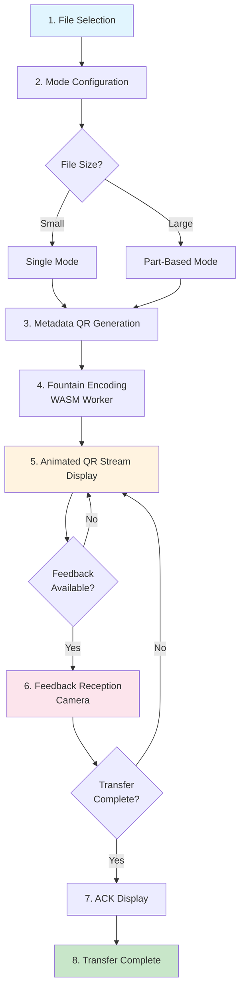
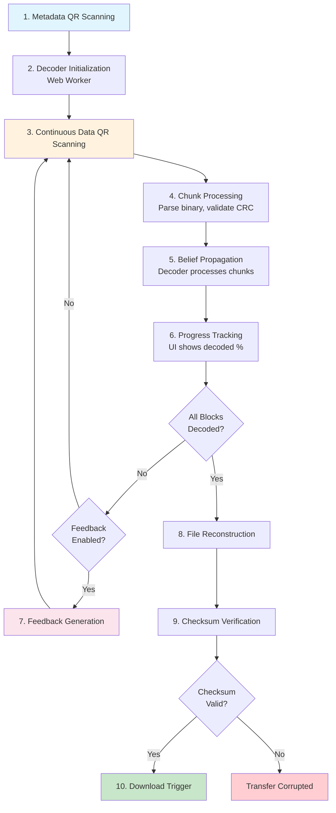
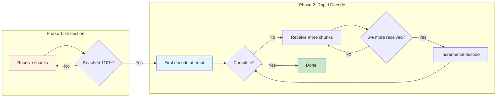

# Offline File Transfer Architecture

A comprehensive guide to the offline file transfer system that enables secure file sharing using animated QR codes without requiring network connectivity.

## Table of Contents
1. [Introduction & Overview](#introduction--overview)
2. [System Architecture](#system-architecture)
3. [Transfer Flow - Sender Side](#transfer-flow---sender-side)
4. [Transfer Flow - Receiver Side](#transfer-flow---receiver-side)
5. [Fountain Code Technical Details](#fountain-code-technical-details)
6. [Binary Data Format](#binary-data-format)
7. [Part-Based Mode](#part-based-mode)
8. [Feedback Mechanism](#feedback-mechanism)
9. [Performance Characteristics](#performance-characteristics)
10. [Configuration Options](#configuration-options)

---

## Introduction & Overview

### What is Offline File Transfer?

Offline file transfer enables secure file sharing between devices using only cameras and displays - no network connection required. The sender displays animated QR codes containing encoded file data, while the receiver scans these codes to reconstruct the original file.

### Why It Exists

- **Air-gapped security**: Transfer sensitive data between isolated systems
- **Network-free operation**: Works in environments without WiFi or cellular connectivity
- **No infrastructure required**: No servers, no cloud services, no accounts
- **Visual verification**: Users can physically see and control the data transfer

### High-Level System Diagram

```
┌─────────────────────────────────────────────────────────────────────────────┐
│                        OFFLINE FILE TRANSFER SYSTEM                          │
├─────────────────────────────────────────────────────────────────────────────┤
│                                                                              │
│   SENDER DEVICE                              RECEIVER DEVICE                 │
│   ┌──────────────┐                          ┌──────────────┐                │
│   │              │                          │              │                │
│   │  File Data   │                          │   Camera     │                │
│   │      ↓       │                          │      ↓       │                │
│   │  Fountain    │     QR Code Stream       │   QR Code    │                │
│   │  Encoder     │  ═══════════════════►    │   Scanner    │                │
│   │      ↓       │      (Display→Camera)    │      ↓       │                │
│   │  Animated    │                          │   Fountain   │                │
│   │  QR Display  │                          │   Decoder    │                │
│   │              │                          │      ↓       │                │
│   │              │      Feedback QR         │  Rebuilt     │                │
│   │   Camera     │  ◄═══════════════════    │  File        │                │
│   │  (optional)  │      (optional)          │              │                │
│   └──────────────┘                          └──────────────┘                │
│                                                                              │
└─────────────────────────────────────────────────────────────────────────────┘
```

### Key Benefits

| Benefit | Description |
|---------|-------------|
| **Offline Operation** | Zero network dependency - works anywhere |
| **Any-Order Reception** | Chunks can be received in any sequence |
| **Rateless Encoding** | Unlimited chunks from finite data |
| **Self-Healing** | Missing chunks are automatically compensated |
| **Part Streaming** | Large files transfer with bounded memory |

---

## System Architecture

### Component Overview

```
┌─────────────────────────────────────────────────────────────────────────────┐
│                          SYSTEM COMPONENTS                                   │
├─────────────────────────────────────────────────────────────────────────────┤
│                                                                              │
│  ┌─────────────────┐    ┌─────────────────┐    ┌─────────────────┐         │
│  │   React UI      │    │   Web Workers   │    │   WASM Module   │         │
│  │   Components    │◄──►│   (Background)  │◄──►│   (Rust Core)   │         │
│  │                 │    │                 │    │                 │         │
│  │  • QR Display   │    │  • Encoder      │    │  • Fountain     │         │
│  │  • Scanner      │    │    Worker       │    │    Encoder      │         │
│  │  • Progress     │    │  • Decoder      │    │  • Fountain     │         │
│  │  • Controls     │    │    Worker       │    │    Decoder      │         │
│  └─────────────────┘    └─────────────────┘    │  • Distribution │         │
│                                                │  • Checksum     │         │
│                                                └─────────────────┘         │
│                                                                              │
└─────────────────────────────────────────────────────────────────────────────┘
```

### Module Responsibilities

| Module | Responsibility |
|--------|----------------|
| **React UI** | User interaction, QR display, camera capture, progress visualization |
| **Web Workers** | Background processing to keep UI responsive, manages WASM lifecycle |
| **WASM Encoder** | Splits file into blocks, generates fountain-encoded chunks |
| **WASM Decoder** | Processes received chunks, runs belief propagation, reconstructs data |
| **Distribution** | Robust Soliton degree sampling for optimal chunk generation |
| **Checksum** | CRC32 validation at chunk, part, and file levels |

### Data Flow Through the System

```
SENDER FLOW:
┌──────────┐    ┌──────────┐    ┌──────────┐    ┌──────────┐    ┌──────────┐
│  User    │    │  React   │    │  Worker  │    │  WASM    │    │  QR      │
│  selects │───►│  reads   │───►│  calls   │───►│  encodes │───►│  renders │
│  file    │    │  file    │    │  encoder │    │  chunks  │    │  stream  │
└──────────┘    └──────────┘    └──────────┘    └──────────┘    └──────────┘

RECEIVER FLOW:
┌──────────┐    ┌──────────┐    ┌──────────┐    ┌──────────┐    ┌──────────┐
│  Camera  │    │  React   │    │  Worker  │    │  WASM    │    │  File    │
│  scans   │───►│  parses  │───►│  adds to │───►│  decodes │───►│  rebuilt │
│  QR      │    │  QR data │    │  decoder │    │  blocks  │    │  & saved │
└──────────┘    └──────────┘    └──────────┘    └──────────┘    └──────────┘
```

---

## Transfer Flow - Sender Side

### Step-by-Step Sender Workflow



### Detailed Step Descriptions

#### Step 1: File Selection
- User selects a file through the file picker
- File metadata extracted (name, size, type)
- System determines appropriate transfer mode based on size

#### Step 2: Mode Configuration
- **Single mode**: Entire file encoded as one unit (smaller files)
- **Part-based mode**: File split into parts for large files
- Block size and QR capacity constraints applied

#### Step 3: Metadata QR Generation
- First QR code contains transfer metadata:
  - Session ID for transfer isolation
  - File name and total size
  - Block size and total block count
  - Part configuration (if applicable)
  - Whole-file checksum
- Receiver must scan this before data chunks

#### Step 4: Fountain Encoding
- File data split into fixed-size blocks
- WASM encoder initialized with blocks and configuration
- Random seed offset generated for session uniqueness
- Encoder ready to generate unlimited chunks

#### Step 5: Animated QR Stream Display
- Chunks generated continuously from encoder
- Each chunk rendered as QR code
- Display cycles through chunks at configured FPS
- Stream continues indefinitely (rateless property)

#### Step 6: Feedback Reception (Optional)
- If sender has camera, can receive feedback QR from receiver
- Feedback indicates which parts have been completed
- Allows sender to advance to next part for faster completion

#### Step 7: ACK Display
- When feedback indicates completion, sender shows ACK QR
- Receiver scans ACK to confirm transfer success
- Prevents receiver from waiting indefinitely

#### Step 8: Transfer Complete
- Both parties confirmed successful transfer
- Session resources released

---

## Transfer Flow - Receiver Side

### Step-by-Step Receiver Workflow



### Detailed Step Descriptions

#### Step 1: Metadata QR Scanning
- Receiver starts camera and waits for metadata QR
- Metadata JSON parsed to extract transfer parameters
- Session ID recorded for chunk filtering

#### Step 2: Decoder Initialization
- Web Worker spawned for background processing
- WASM decoder instantiated with metadata parameters
- Degree distribution computed for belief propagation
- Data structures initialized for chunk tracking

#### Step 3: Continuous Data QR Scanning
- Camera continuously captures frames
- QR decoder extracts binary data from each frame
- Magic bytes checked to identify fountain chunks
- Session ID verified to filter stray QR codes

#### Step 4: Chunk Processing
- Binary chunk parsed to extract:
  - Seed value
  - Degree and block indices
  - Part information (if applicable)
  - Chunk data payload
  - CRC32 checksum
- Checksum validated; corrupted chunks discarded

#### Step 5: Belief Propagation
- Chunk added to decoder's processing queue
- If chunk references already-decoded blocks, XOR them out
- If chunk becomes degree-1 (singleton), decode that block
- Propagate newly decoded blocks to all pending chunks
- Cascade continues until no more singletons exist

#### Step 6: Progress Tracking
- UI displays: decoded blocks / total blocks
- Part progress shown for part-based transfers
- Scanning rate and decode efficiency metrics

#### Step 7: Feedback Generation
- When a part completes:
  - Verify part checksum matches expected value
  - Generate feedback QR with part completion status
- Display feedback QR for sender to scan

#### Step 8: File Reconstruction
- When all blocks decoded, concatenate in order
- Trim padding from final block to exact file size

#### Step 9: Checksum Verification
- Compute CRC32 of reconstructed data
- Compare against checksum from metadata
- If mismatch, transfer marked as corrupted

#### Step 10: Download Trigger
- Browser download initiated with original filename
- File saved to user's downloads folder

---

## Fountain Code Technical Details

### What are LT (Luby Transform) Codes?

LT codes are **rateless erasure codes** - they can generate an unlimited number of encoded chunks from a finite source. Unlike traditional error correction codes with fixed redundancy, fountain codes let the receiver collect "enough" chunks from any subset.

```
┌─────────────────────────────────────────────────────────────────────────────┐
│                    FOUNTAIN CODE CONCEPT                                     │
├─────────────────────────────────────────────────────────────────────────────┤
│                                                                              │
│   Source Data: [Block 0] [Block 1] [Block 2] [Block 3]                      │
│                    │         │         │         │                          │
│                    ▼         ▼         ▼         ▼                          │
│              ┌─────────────────────────────────────────┐                    │
│              │          Fountain Encoder               │                    │
│              │    (infinite chunk generator)           │                    │
│              └─────────────────────────────────────────┘                    │
│                              │                                              │
│                              ▼                                              │
│   Encoded Chunks:  ○  ○  ○  ○  ○  ○  ○  ○  ○  ○  ...  ∞                    │
│                    ↓  ↓  ↓  ↓  ↓  ↓  ↓  ↓  ↓  ↓                            │
│                                                                              │
│   Receiver needs ANY ~110% of original size to decode                       │
│   (e.g., 4 blocks → need ~4.4 chunks worth of data)                         │
│                                                                              │
└─────────────────────────────────────────────────────────────────────────────┘
```

### Degree Distribution (Robust Soliton with Doping)

The degree of a chunk determines how many source blocks are XORed together. The degree distribution critically affects decode efficiency.

```
┌─────────────────────────────────────────────────────────────────────────────┐
│                    DEGREE DISTRIBUTION                                       │
├─────────────────────────────────────────────────────────────────────────────┤
│                                                                              │
│   Probability                                                                │
│        │                                                                     │
│   0.30 ┤  ██                                                                │
│        │  ██ ← Degree 1 (8% forced + natural)                               │
│   0.20 ┤  ██ ██                                                             │
│        │  ██ ██ ██ ← Degrees 2-3 (18% forced)                               │
│   0.10 ┤  ██ ██ ██ ██                                                       │
│        │  ██ ██ ██ ██ ██ ██ ██                                               │
│   0.05 ┤  ██ ██ ██ ██ ██ ██ ██ ██ ██ ██                                     │
│        │  ██ ██ ██ ██ ██ ██ ██ ██ ██ ██ ██ ██ ██                            │
│        └──1──2──3──4──5──6──7──8──9─10─11─12─13─...─► Degree                │
│                                                                              │
│   Doping Parameters:                                                         │
│   • degree1_rate = 8%  → Forces degree-1 for faster initial decoding        │
│   • low_degree_rate = 18% → Forces degree 2-3 for robust coverage           │
│                                                                              │
└─────────────────────────────────────────────────────────────────────────────┘
```

**Robust Soliton Distribution** combines:
- **Ideal Soliton**: Mathematical optimum (but fragile in practice)
- **Robust component**: Adds "spike" near k/R for reliability
- **Doping**: Forces additional low-degree chunks for practical performance

### Encoding Process

```
┌─────────────────────────────────────────────────────────────────────────────┐
│                    ENCODING PROCESS                                          │
├─────────────────────────────────────────────────────────────────────────────┤
│                                                                              │
│   Step 1: Split into Blocks                                                 │
│   ┌─────────────────────────────────────────────────────────────────────┐   │
│   │  File Data (1200 bytes)                                              │   │
│   │  ┌────────┬────────┬────────┐                                       │   │
│   │  │Block 0 │Block 1 │Block 2 │  (400 bytes each)                     │   │
│   │  │ 400B   │ 400B   │ 400B   │                                       │   │
│   │  └────────┴────────┴────────┘                                       │   │
│   └─────────────────────────────────────────────────────────────────────┘   │
│                                                                              │
│   Step 2: Generate Chunk (seed → degree → indices → XOR)                    │
│   ┌─────────────────────────────────────────────────────────────────────┐   │
│   │  Seed: 42                                                            │   │
│   │    ├─► Degree: 2 (from distribution)                                │   │
│   │    └─► Indices: [0, 2] (random selection)                           │   │
│   │                                                                      │   │
│   │  Chunk Data = Block[0] XOR Block[2]                                 │   │
│   └─────────────────────────────────────────────────────────────────────┘   │
│                                                                              │
│   Step 3: Repeat with incrementing seeds → infinite stream                  │
│                                                                              │
└─────────────────────────────────────────────────────────────────────────────┘
```

### Decoding Process (Belief Propagation / Peeling Algorithm)

```
┌─────────────────────────────────────────────────────────────────────────────┐
│                    BELIEF PROPAGATION DECODING                               │
├─────────────────────────────────────────────────────────────────────────────┤
│                                                                              │
│   Initial State: No blocks decoded                                          │
│                                                                              │
│   ┌─────────────────────────────────────────────────────────────────────┐   │
│   │  Chunk A: indices=[1]         → Degree 1! (Singleton)               │   │
│   │  Chunk B: indices=[0,1]       → Degree 2                            │   │
│   │  Chunk C: indices=[0,1,2]     → Degree 3                            │   │
│   └─────────────────────────────────────────────────────────────────────┘   │
│                                                                              │
│   Step 1: Process Chunk A (singleton)                                       │
│   ┌─────────────────────────────────────────────────────────────────────┐   │
│   │  Chunk A has degree 1 → Block[1] = Chunk A's data                   │   │
│   │  ✓ Block 1 decoded!                                                  │   │
│   └─────────────────────────────────────────────────────────────────────┘   │
│                                                                              │
│   Step 2: Propagate Block 1 to other chunks                                 │
│   ┌─────────────────────────────────────────────────────────────────────┐   │
│   │  Chunk B: indices=[0,1] → XOR out Block 1 → indices=[0]  (Singleton!)│  │
│   │  Chunk C: indices=[0,1,2] → XOR out Block 1 → indices=[0,2]         │   │
│   └─────────────────────────────────────────────────────────────────────┘   │
│                                                                              │
│   Step 3: Process Chunk B (now singleton)                                   │
│   ┌─────────────────────────────────────────────────────────────────────┐   │
│   │  Chunk B has degree 1 → Block[0] = Chunk B's reduced data           │   │
│   │  ✓ Block 0 decoded!                                                  │   │
│   └─────────────────────────────────────────────────────────────────────┘   │
│                                                                              │
│   Step 4: Propagate Block 0                                                 │
│   ┌─────────────────────────────────────────────────────────────────────┐   │
│   │  Chunk C: indices=[0,2] → XOR out Block 0 → indices=[2]  (Singleton!)│  │
│   │  Block[2] = Chunk C's reduced data                                  │   │
│   │  ✓ Block 2 decoded!                                                  │   │
│   └─────────────────────────────────────────────────────────────────────┘   │
│                                                                              │
│   ✓ All blocks decoded! Reconstruct original file.                          │
│                                                                              │
└─────────────────────────────────────────────────────────────────────────────┘
```

### Decoding Strategy & Parameter Optimization

The system uses carefully tuned parameters to optimize for a specific decoding profile: **slow progress at the beginning, rapid completion at the end, with no "tail problem"** where you'd need to scan many additional chunks just to find the last few missing blocks.

#### The Deferred Decoding Strategy

Rather than attempting to decode after every chunk, the decoder waits strategically:



**Why wait until 110%?**

Attempting decoding too early is computationally wasteful. With only 80% of chunks received, belief propagation will stall quickly - most chunks have high degree and can't reduce to singletons without other blocks already decoded. The decoder would do significant work only to fail.

By waiting until ~110% of the theoretical minimum:
- High probability of immediate success (>95%)
- Single decode pass typically completes the entire file
- Avoids repeated expensive decode attempts that fail

**Decode Trigger Thresholds:**

| Phase | Threshold | Purpose |
|-------|-----------|---------|
| Early check | max(10, 2%) chunks | Error detection only (corrupt metadata, wrong session) |
| First decode | 110% of total blocks | High-probability complete decode |
| Incremental | max(10, 5%) additional chunks | Finish remaining blocks if first attempt incomplete |

#### Avoiding the Tail Problem with Degree Doping

The "tail problem" in fountain codes occurs when most blocks are decoded but a few remain locked in high-degree chunks. Without degree-1 chunks covering those specific blocks, you might scan hundreds of additional chunks hoping to randomly hit the right ones.

**Solution: Forced Degree Doping**

The encoder artificially injects low-degree chunks:

| Parameter | Value | Effect |
|-----------|-------|--------|
| `degree1_rate` | 8% | Force 8% of chunks to be degree-1 (singletons) |
| `low_degree_rate` | 18% | Force 18% of chunks to be degree 2-3 |

```
Chunk Degree Distribution (with doping):

  Probability
       │
  0.30 ┤  ██
       │  ██ ← 8% forced degree-1 + natural singletons
  0.20 ┤  ██ ██
       │  ██ ██ ██ ← 18% forced degree 2-3
  0.10 ┤  ██ ██ ██ ██ ██ ██
       │  ██ ██ ██ ██ ██ ██ ██ ██ ██
       └──1──2──3──4──5──6──7──8──9──...──► Degree

Without doping: Pure Robust Soliton has fewer low-degree chunks
With doping: Guaranteed steady stream of easily-decodable chunks
```

**Why this works:**

1. **Degree-1 chunks (8%)**: Each singleton directly decodes one block. With ~110% overhead, you receive roughly `0.08 × 1.10 × k = 0.088k` singletons for k blocks. Even if they don't cover every block directly, they seed the peeling process.

2. **Degree 2-3 chunks (18%)**: These quickly become singletons once any referenced block is decoded. They create cascade opportunities.

3. **Combined effect**: The low-degree chunks ensure that every block has multiple paths to decoding. The tail problem is eliminated because there's always fresh low-degree material arriving, not just high-degree chunks waiting for other blocks.

#### Adaptive Throttling for End-Phase Speedup

After the first decode attempt at 110%, if decoding isn't complete, the system switches to adaptive throttling:

```
Progress vs Decode Frequency:

Chunks received:   0%────────100%────110%────115%────120%────►
                   │          │       │       │       │
Decode attempts:   │    (none, just collecting)       │
                   │          │       ▼       ▼       ▼
                   │          │    decode  decode  decode
                   │          │       │       │       │
                   └──────────┴───────┴───────┴───────┘
                    Phase 1: Wait    Phase 2: Frequent attempts
```

**Why this profile is optimal:**

| Phase | Behavior | Rationale |
|-------|----------|-----------|
| 0-110% | No decode attempts | Decoding would fail; save CPU cycles |
| 110% | First full decode | High success probability |
| 110%+ | Decode every 5% (or 10 chunks min) | Quickly finish remaining blocks |

The **5% incremental threshold** (minimum 10 chunks) balances:
- **Responsiveness**: Don't wait too long if only a few blocks remain
- **Efficiency**: Don't decode after every single chunk (wasteful)

#### Max Degree Capping

To prevent pathologically high-degree chunks that waste QR capacity and rarely help decoding:

```
Max Degree = min(
    ADAPTIVE_MULTIPLIER × √k,     // Scale with block count (2.5 × √k)
    MAX_ADAPTIVE_DEGREE,           // Hard cap at 40
    (QR_capacity - overhead) / 2   // Fit in QR code (2 bytes per index)
)

Clamped to: MIN_ADAPTIVE_DEGREE (8) ≤ max_degree ≤ MAX_ADAPTIVE_DEGREE (40)
```

| Parameter | Value | Purpose |
|-----------|-------|---------|
| `ADAPTIVE_MULTIPLIER` | 2.5 | Degree scales as 2.5×√k |
| `MIN_ADAPTIVE_DEGREE` | 8 | Floor for small files |
| `MAX_ADAPTIVE_DEGREE` | 40 | Ceiling for large files |

**Rationale**: Very high-degree chunks (e.g., degree 100) are almost useless early in decoding and waste space storing indices. Capping at 40 ensures chunks remain useful while still providing good coverage diversity.

#### Why ~110% Overhead is Needed

Traditional block codes require receiving exactly the same number of encoded symbols as source symbols. Fountain codes are probabilistic:

- **Theoretical minimum**: 100% (k chunks for k blocks)
- **Practical overhead**: ~5-15% extra chunks needed
- **Reason**: Some chunks may not immediately help (high-degree chunks need other blocks first)
- **This system**: Typically completes at ~110% of source size

The overhead varies based on:
- Number of source blocks (more blocks → closer to 100%)
- Degree distribution parameters (doping reduces overhead)
- Order of chunk reception (random is fine due to rateless property)

---

## Binary Data Format

### Chunk Binary Structure

Each fountain chunk is serialized into a compact binary format for QR encoding:

```
┌─────────────────────────────────────────────────────────────────────────────┐
│                    CHUNK BINARY FORMAT                                       │
├─────────────────────────────────────────────────────────────────────────────┤
│                                                                              │
│   Offset   Size    Field                                                    │
│   ─────────────────────────────────────────────────                         │
│   0        2       Magic bytes [0xFF][0xFD]                                 │
│   2        2       Seed (uint16, big-endian)                                │
│   4        1       Degree (uint8)                                           │
│   5        1       NumIndices (uint8)                                       │
│   6        2*N     Block indices (uint16 each, big-endian)                  │
│   ...      8       Part metadata (if part-based mode):                      │
│                      - Current part (uint16)                                │
│                      - Total parts (uint16)                                 │
│                      - Part checksum (4 bytes)                              │
│   ...      var     Chunk data (XORed block content)                         │
│   -4       4       CRC32 checksum (final 4 bytes)                           │
│                                                                              │
│   Example (single-mode, degree 2):                                          │
│   ┌──┬──┬──┬──┬──┬──┬──┬──┬──┬─────────────────────┬──┬──┬──┬──┐           │
│   │FF│FD│00│2A│02│02│00│00│00│02│   [chunk data]   │CRC32    │           │
│   └──┴──┴──┴──┴──┴──┴──┴──┴──┴─────────────────────┴──┴──┴──┴──┘           │
│    magic  seed deg N  idx0   idx2     payload         checksum              │
│                                                                              │
└─────────────────────────────────────────────────────────────────────────────┘
```

### Metadata JSON Structure

The first QR code contains JSON metadata:

```
┌─────────────────────────────────────────────────────────────────────────────┐
│                    METADATA JSON                                             │
├─────────────────────────────────────────────────────────────────────────────┤
│                                                                              │
│   {                                                                          │
│     "type": "fountain_metadata",                                            │
│     "sessionId": "a1b2c3d4",           // Unique transfer identifier        │
│     "fileName": "document.pdf",         // Original filename                │
│     "totalSize": 125000,                // File size in bytes               │
│     "blockSize": 400,                   // Bytes per block                  │
│     "totalBlocks": 313,                 // Total block count                │
│     "checksum": "e8f4a2b1",             // Whole-file CRC32                 │
│     "seedOffset": 12345,                // Session random offset            │
│                                                                              │
│     // Part-based mode only:                                                │
│     "totalParts": 3,                    // Number of parts                  │
│     "partSize": 512000,                 // Bytes per part                   │
│     "partChecksums": [                  // Per-part checksums               │
│       "a1b2c3d4",                                                           │
│       "e5f6a7b8",                                                           │
│       "c9d0e1f2"                                                            │
│     ]                                                                        │
│   }                                                                          │
│                                                                              │
└─────────────────────────────────────────────────────────────────────────────┘
```

### Feedback/ACK Formats

```
┌─────────────────────────────────────────────────────────────────────────────┐
│                    FEEDBACK FORMATS                                          │
├─────────────────────────────────────────────────────────────────────────────┤
│                                                                              │
│   Part-Complete Feedback:                                                   │
│   {                                                                          │
│     "type": "FOUNTAIN_FEEDBACK",                                            │
│     "mode": "part-complete",                                                │
│     "sessionId": 12345,                                                     │
│     "sequence": 1,                                                          │
│     "currentPart": 0,                                                       │
│     "totalParts": 3                                                         │
│   }                                                                          │
│                                                                              │
│   Full-Complete Feedback:                                                   │
│   {                                                                          │
│     "type": "transfer_complete",                                            │
│     "sessionId": "a1b2c3d4",                                                │
│     "fileChecksum": "e8f4a2b1"          // Verified whole-file checksum     │
│   }                                                                          │
│                                                                              │
│   Acknowledgment (Sender → Receiver):                                       │
│   {                                                                          │
│     "type": "ack",                                                          │
│     "sessionId": "a1b2c3d4"                                                 │
│   }                                                                          │
│                                                                              │
└─────────────────────────────────────────────────────────────────────────────┘
```

### Checksum Verification Layers

```
┌─────────────────────────────────────────────────────────────────────────────┐
│                    CHECKSUM LAYERS                                           │
├─────────────────────────────────────────────────────────────────────────────┤
│                                                                              │
│   Layer 1: Per-Chunk CRC32                                                  │
│   └── Validates each QR code's binary data wasn't corrupted                 │
│       └── Reject immediately if checksum fails                              │
│                                                                              │
│   Layer 2: Per-Part CRC32 (part-based mode)                                 │
│   └── Validates reconstructed part data matches expected                    │
│       └── Allows early detection before full file complete                  │
│       └── Enables memory release after part verified                        │
│                                                                              │
│   Layer 3: Whole-File CRC32                                                 │
│   └── Final validation of entire reconstructed file                         │
│       └── Catches any assembly errors                                       │
│       └── Confirms transfer integrity                                       │
│                                                                              │
└─────────────────────────────────────────────────────────────────────────────┘
```

---

## Part-Based Mode

### When and Why Parts are Used

Large files are divided into parts to enable:
- **Bounded memory usage**: Only one part's blocks in memory at a time
- **Incremental progress**: Verify parts independently
- **Faster feedback**: Report part completion without waiting for full file
- **Streaming operation**: Start processing while still receiving

```
┌─────────────────────────────────────────────────────────────────────────────┐
│                    PART-BASED TRANSFER                                       │
├─────────────────────────────────────────────────────────────────────────────┤
│                                                                              │
│   File: 1.5 MB document                                                     │
│                                                                              │
│   ┌──────────────┬──────────────┬──────────────┐                            │
│   │   Part 0     │   Part 1     │   Part 2     │                            │
│   │   512 KB     │   512 KB     │   476 KB     │                            │
│   └──────────────┴──────────────┴──────────────┘                            │
│                                                                              │
│   Transfer Timeline:                                                         │
│   ───────────────────────────────────────────────────────────►              │
│                                                                              │
│   Part 0: [Encode] ──► [Transfer QRs] ──► [Decode] ──► [Verify ✓]          │
│                                              │                               │
│                               ┌──────────────┘                              │
│                               ▼                                              │
│   Part 1:                [Encode] ──► [Transfer QRs] ──► [Decode] ──► [✓]  │
│                                                            │                │
│                                              ┌─────────────┘                │
│                                              ▼                               │
│   Part 2:                               [Encode] ──► [Transfer] ──► [✓]    │
│                                                                              │
│   Memory at any time: ~512 KB (one part) + overhead                         │
│                                                                              │
└─────────────────────────────────────────────────────────────────────────────┘
```

### Part-Level Checksum Validation

Each part has its own CRC32 checksum included in metadata. When a part's blocks are all decoded:
1. Concatenate blocks for that part
2. Compute CRC32 of part data
3. Compare against expected part checksum
4. If match: part is verified, can notify sender
5. If mismatch: continue receiving chunks (may have decoding errors)

### Memory Optimization Through Streaming

```
┌─────────────────────────────────────────────────────────────────────────────┐
│                    MEMORY LIFECYCLE (DECODER)                                │
├─────────────────────────────────────────────────────────────────────────────┤
│                                                                              │
│   Memory                                                                     │
│     │                                                                        │
│     │    Part 0 blocks                                                      │
│   ▲ │   ┌──────────┐                                                        │
│   │ │   │██████████│ ← Receiving Part 0 chunks                              │
│   │ │   │██████████│                                                        │
│   │ │   └──────────┘                                                        │
│   │ │              ╲                                                         │
│   │ │               ╲ Part 0 verified → blocks released                     │
│   │ │                ╲                                                       │
│   │ │                 ┌──────────┐                                          │
│   │ │                 │██████████│ ← Part 1 blocks                          │
│   │ │                 │██████████│                                          │
│   │ │                 └──────────┘                                          │
│   │ │                            ╲                                           │
│   │ │                             ╲ Part 1 verified → released              │
│   │ │                              ╲                                         │
│   │ │                               ┌──────────┐                            │
│   │ │                               │████████  │ ← Part 2 (smaller)         │
│   │ │                               └──────────┘                            │
│     └───────────────────────────────────────────────────────► Time          │
│                                                                              │
│   Peak memory: ~partSize + pending chunks (not full fileSize)               │
│                                                                              │
└─────────────────────────────────────────────────────────────────────────────┘
```

### Part Transition Protocol

When sender detects part completion (via feedback or time-based):
1. Encoder marks current part as complete
2. Source blocks for completed part can be released (optional)
3. Encoder begins generating chunks for next part
4. Part metadata in chunks updates to indicate new part number
5. Receiver detects part change, initializes new part decoder state

---

## Feedback Mechanism

### Overview

Feedback allows bi-directional communication to optimize transfer:

```
┌─────────────────────────────────────────────────────────────────────────────┐
│                    FEEDBACK SYSTEM                                           │
├─────────────────────────────────────────────────────────────────────────────┤
│                                                                              │
│   SENDER                                    RECEIVER                         │
│   ┌──────────────┐                         ┌──────────────┐                 │
│   │              │   Data QR Stream        │              │                 │
│   │   Display    │ ═══════════════════►    │   Camera     │                 │
│   │              │                         │              │                 │
│   │              │                         │              │                 │
│   │   Camera     │   Feedback QR           │   Display    │                 │
│   │  (optional)  │ ◄═══════════════════    │  (feedback)  │                 │
│   │              │                         │              │                 │
│   └──────────────┘                         └──────────────┘                 │
│                                                                              │
│   Feedback enables:                                                          │
│   • Part completion notification → Sender advances to next part             │
│   • Transfer completion → Sender displays ACK                               │
│                                                                              │
└─────────────────────────────────────────────────────────────────────────────┘
```

### Part-Complete Feedback Mode

When receiver completes a part:
1. Decoder verifies part checksum
2. Receiver generates "part_complete" feedback QR
3. Displays feedback QR for sender's camera
4. Sender acknowledges and transitions to next part
5. Receiver resumes scanning for next part's chunks

### ACK Protocol Flow

```
┌─────────────────────────────────────────────────────────────────────────────┐
│                    ACK PROTOCOL                                              │
├─────────────────────────────────────────────────────────────────────────────┤
│                                                                              │
│   1. Receiver completes decoding and verifies file checksum                 │
│                                                                              │
│   2. Receiver displays "transfer_complete" feedback QR                      │
│                                                                              │
│   3. Sender's camera captures feedback QR                                   │
│                                                                              │
│   4. Sender stops data stream, displays ACK QR                              │
│                                                                              │
│   5. Receiver scans ACK QR, confirms sender knows transfer complete         │
│                                                                              │
│   6. Both parties show "Transfer Complete" UI                               │
│                                                                              │
│   Without ACK: Receiver might keep waiting for more chunks                  │
│   With ACK: Clean termination, both sides know transfer succeeded           │
│                                                                              │
└─────────────────────────────────────────────────────────────────────────────┘
```

### Manual Fallback for Senders Without Cameras

If sender device has no camera (or user declines camera access):
1. Receiver shows visual completion indicator (checkmark, progress 100%)
2. Sender observes receiver's screen visually
3. Sender manually clicks "Complete" button
4. Displays ACK QR for receiver to scan
5. Receiver confirms via ACK

---

## Performance Characteristics

### Computational Complexity

| Operation | Time Complexity | Notes |
|-----------|-----------------|-------|
| Chunk generation | O(degree) | Typically 1-40 XOR operations |
| Chunk parsing | O(1) | Fixed header parsing |
| Add chunk to decoder | O(degree) | Index lookups and XOR |
| Belief propagation step | O(chunks × avg_degree) | Amortized across all chunks |
| Full decode | O(n × avg_degree) | Where n = total chunks received |

### Memory Usage Patterns

| Component | Memory | Mode |
|-----------|--------|------|
| Encoder - blocks | O(file_size) | Single mode |
| Encoder - blocks | O(part_size) | Part-based mode |
| Decoder - decoded blocks | O(file_size) | Always |
| Decoder - pending chunks | O(pending_count × block_size) | Cleared as blocks decode |
| Decoder - chunk indices | O(pending_count × avg_degree) | Metadata for pending |

### Scanning Rates and FPS Considerations

```
┌─────────────────────────────────────────────────────────────────────────────┐
│                    SCANNING PERFORMANCE                                      │
├─────────────────────────────────────────────────────────────────────────────┤
│                                                                              │
│   Display FPS vs Scan Rate:                                                 │
│                                                                              │
│   Display: ▓▓░░▓▓░░▓▓░░▓▓░░▓▓░░  (QR changes at N fps)                     │
│   Camera:  ──●───●───●───●───●──  (captures at M fps)                       │
│                                                                              │
│   If display FPS > camera FPS: Some QRs missed (OK with fountain codes)     │
│   If display FPS < camera FPS: Same QR scanned multiple times (deduplicated)│
│                                                                              │
│   Optimal: Display FPS ≈ Camera FPS for maximum throughput                  │
│                                                                              │
│   Typical rates:                                                             │
│   • QR display: 5-15 FPS                                                    │
│   • Camera capture: 15-30 FPS                                               │
│   • Effective unique chunks/sec: 5-15                                       │
│                                                                              │
│   Throughput = chunks/sec × chunk_data_size                                 │
│   Example: 10 chunks/sec × 400 bytes = 4 KB/sec                             │
│                                                                              │
└─────────────────────────────────────────────────────────────────────────────┘
```

---

## Configuration Options

### Encoder Tuning Parameters

| Parameter | Default | Description |
|-----------|---------|-------------|
| `block_size` | 400 bytes | Size of each source block |
| `c` | 0.2 | Robust Soliton constant (affects spike location) |
| `delta` | 0.01 | Failure probability parameter |
| `degree1_rate` | 0.08 (8%) | Probability of forcing degree-1 chunks |
| `low_degree_rate` | 0.18 (18%) | Probability of forcing degree 2-3 chunks |
| `seed_offset` | random | Session-unique offset for chunk seeds |

### QR Capacity Constraints

| Parameter | Default | Description |
|-----------|---------|-------------|
| `max_qr_data_size` | 2953 bytes | Maximum QR code binary capacity (version 40-L) |
| `fixed_overhead` | 10 bytes | Header bytes per chunk (magic, seed, indices) |
| `part_overhead` | 8 bytes | Additional overhead in part-based mode |
| `effective_payload` | ~2935 bytes | Available for chunk data |

### Part Size Options

| File Size | Recommended Part Size | Rationale |
|-----------|----------------------|-----------|
| < 500 KB | No parts (single mode) | Overhead not worth it |
| 500 KB - 2 MB | 512 KB | Good balance |
| 2 MB - 10 MB | 1 MB | Larger parts, fewer transitions |
| > 10 MB | 2 MB | Memory-bounded streaming |

### Decoder Tuning Parameters

| Parameter | Default | Description |
|-----------|---------|-------------|
| `decode_throttle_count` | 10 | Chunks to accumulate before running decode |
| `adaptive_throttle_percentage` | 0.05 (5%) | Incremental decode threshold |
| `min_incremental_chunks` | 10 | Minimum chunks for incremental decode attempt |

---

## Summary

The offline file transfer system combines fountain codes with QR-based visual communication to enable secure, network-free file sharing. Key architectural decisions include:

1. **Rateless fountain codes** allow flexible, order-independent chunk reception
2. **WebAssembly core** provides near-native performance in browsers
3. **Web Workers** keep the UI responsive during heavy encoding/decoding
4. **Part-based streaming** enables large file transfers with bounded memory
5. **Layered checksums** ensure data integrity at multiple levels
6. **Bidirectional feedback** optimizes transfer efficiency when possible

The system gracefully degrades when feedback isn't available (sender has no camera), still completing transfers through the probabilistic properties of fountain codes.
